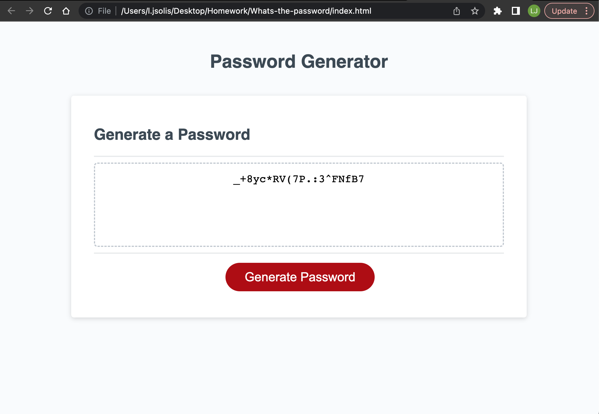

# Whats-the-password

## Description

Creating a functioning password generator was the challenge assignment for week 3. The following challenge provided a starter code with an index.html and styles.css sheet already created. The script.js was were our code needed to be written. The criteria needed to be met for the challenge was for the password to have a length between 8 - 128 characters. Character for the password were to include special characters, upper case letters, lower case letters, and numerical values. The user would be able to decide on which characters they wanted to be included in their password. Once the user made their decisions a random password would be generate.

## Website Link

[Password Generator](https://solis07.github.io/Whats-the-password/)

## Screenshot

